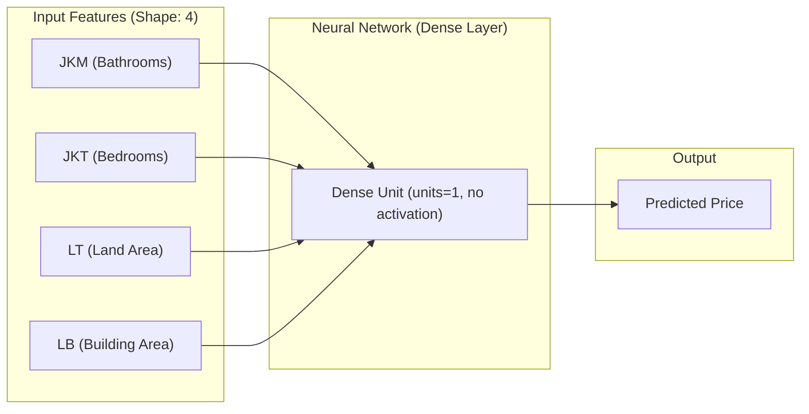

# 🏡 House Price Prediction & Classification in Jakarta

> [!NOTE]
> **Historic Milestone**: This is my very first Machine Learning project, developed in **late 2023**! It represents my initial steps into the fascinating world of data science, neural networks, exploratory data analysis, and predictive modeling.

---

## 📌 Project Overview
This repository contains a complete machine learning workflow focused on analyzing and predicting house prices in South Jakarta. The project integrates two main concepts:
1. **House Price Classification (Binning)**: Segmenting house listings into categorized price brackets (*Harga Rendah*, *Harga Menengah*, and *Harga Tinggi*) using statistical quartiles to understand and visualize data characteristics.
2. **Deep Learning Regression Model**: Constructing and training a single-neuron Dense Neural Network using **TensorFlow** and **Keras** to predict house values based on structural attributes.

---

## 📊 Dataset & Features
The model operates on a real-estate dataset (`harga_rumah.xlsx` / `data_rumah.xlsx`) featuring **1,001 entries** of real-estate data with the following attributes:

| Feature Name | Indonesian Description | English Translation | Min Value | Max Value | Mean Value |
| :--- | :--- | :--- | :--- | :--- | :--- |
| `JKM` | Jumlah Kamar Mandi | Number of Bathrooms | 1 | 27 | 3.9 |
| `JKT` | Jumlah Kamar Tidur | Number of Bedrooms | 1 | 27 | 4.4 |
| `LT` | Luas Tanah | Land Area in sqm | 22 m² | 6,790 m² | 530.5 m² |
| `LB` | Luas Bangunan | Building Area in sqm | 38 m² | 10,000 m² | 487.3 m² |
| **`HARGA`** | Harga Rumah | **House Price (Target)** | Rp 430M | Rp 250B | Rp 17.47B |

---

## 📈 Exploratory Data Analysis & Binning
To make sense of the vast price distribution and explore relationships, the data was grouped into three distinct categories based on mathematical quartiles:

*   **Low Price (*Harga Rendah*)**: $\le \text{Q1}$ (Rp 6,750,000,000 or below)
*   **Medium Price (*Harga Menengah*)**: $\text{Q1} < \text{Price} \le \text{Q2}$ (Between Rp 6,750,000,000 and Rp 13,500,000,000)
*   **High Price (*Harga Tinggi*)**: $> \text{Q2}$ (Rp 13,500,000,000 and above)

Using Seaborn and Matplotlib, regression plots (`sns.regplot`) and scatter plots (`sns.scatterplot`) were generated to examine how land size, building size, and room numbers correlate with the house prices across different classes.

---

## 🧠 Model Architecture & Training
The core prediction is handled by a neural network regressor built with **TensorFlow/Keras**.

### Architecture Diagram


### Hyperparameters & Training Settings:
*   **Framework**: TensorFlow 2.x (Keras API)
*   **Network Layer**: `tf.keras.layers.Dense(units=1, input_shape=[4])` (A single dense unit, mapping the 4 features linearly to a single value, representing a Deep Learning approach to Multiple Linear Regression)
*   **Loss Function**: Mean Absolute Error (`mae`)
*   **Optimizer**: Stochastic Gradient Descent (`sgd`)
*   **Training Epochs**: **15,000 epochs** for thorough optimization and model learning convergence.

---

## 💻 Interactive Command Line Inference
The final cell of the Jupyter Notebook sets up an interactive console script that allows a user to input their custom house parameters and get a calculated pricing projection:

*   *Number of Bathrooms*
*   *Number of Bedrooms*
*   *Land Area (LT)*
*   *Building Area (LB)*

The model processes the input, applies inference scaling, and prints out the final price prediction:
```bash
Harga Rumah Yang anda Minta adalah : RP. <Predicted_Price>
```

---

## 🛠️ Installation & Setup

1.  **Clone the Repository**:
    ```bash
    git clone <your-repository-url>
    cd Classification
    ```

2.  **Install Required Dependencies**:
    Make sure you have Python installed (preferably version 3.8 - 3.11), then run:
    ```bash
    pip install tensorflow pandas numpy openpyxl seaborn matplotlib
    ```

3.  **Run the Jupyter Notebook**:
    Open the notebook interface to run the exploratory analyses and train/interact with the model:
    ```bash
    jupyter notebook main.ipynb
    ```

---

## 🎓 Learnings & Reflections
As my **first-ever Machine Learning project** completed in **late 2023**, this codebase holds significant personal value and represents crucial milestones:
*   Developing an intuition for exploratory data analysis (EDA) using statistics and visualizations.
*   Discovering how data binning helps break continuous targets into analytical classification groups.
*   Hands-on implementation of a basic regression model inside the TensorFlow & Keras ecosystems.
*   Structuring raw real-world data from spreadsheets (`.xlsx`) to be fed into ML arrays.
